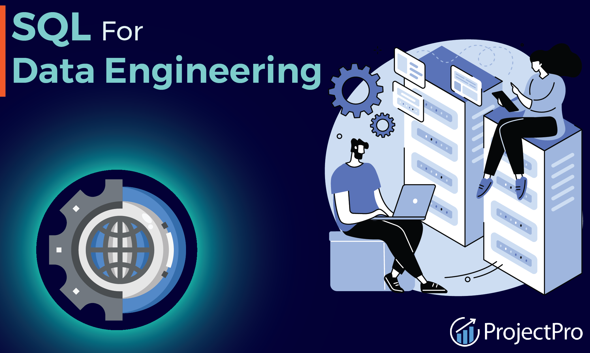

# 🧠 SQL & Data Engineering Projects

A collection of practical SQL, Data Analytics, and Data Engineering projects focused on solving real world problems through data.

# 📂 Projects
Project	Focus	Key Skills
- 📊 Job Market Analysis	Data Engineering skills, demand & salary analysis	SQL, EDA, DuckDB
- 🔎 Exploratory Data Analysis	Data exploration and business insights	SQL, Aggregations, Joins
- ⚙️ Data Engineering	Data transformation and pipeline workflows	SQL, Python, ETL/ELT
- 🛠️ Technologies

SQL • Python • DuckDB • BigQuery • dbt • Git • Data Modelling • ETL/ELT

# 🎯 What This Repository Demonstrates
Writing analytical SQL queries
Data cleaning and transformation
Exploratory data analysis
Data modelling and ETL/ELT concepts
Extracting actionable insights from datasets
Building a foundation toward Analytics Engineering & Data Engineering